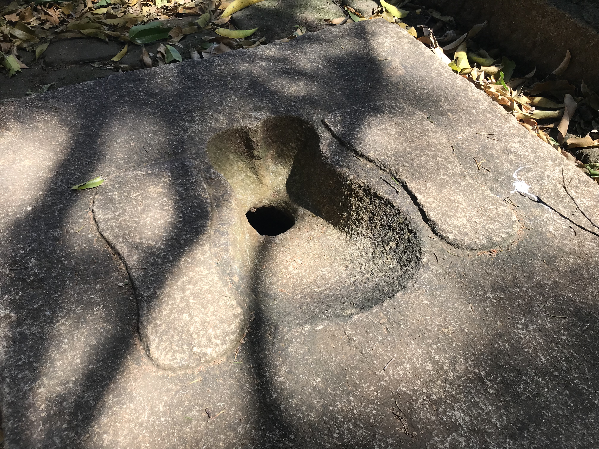
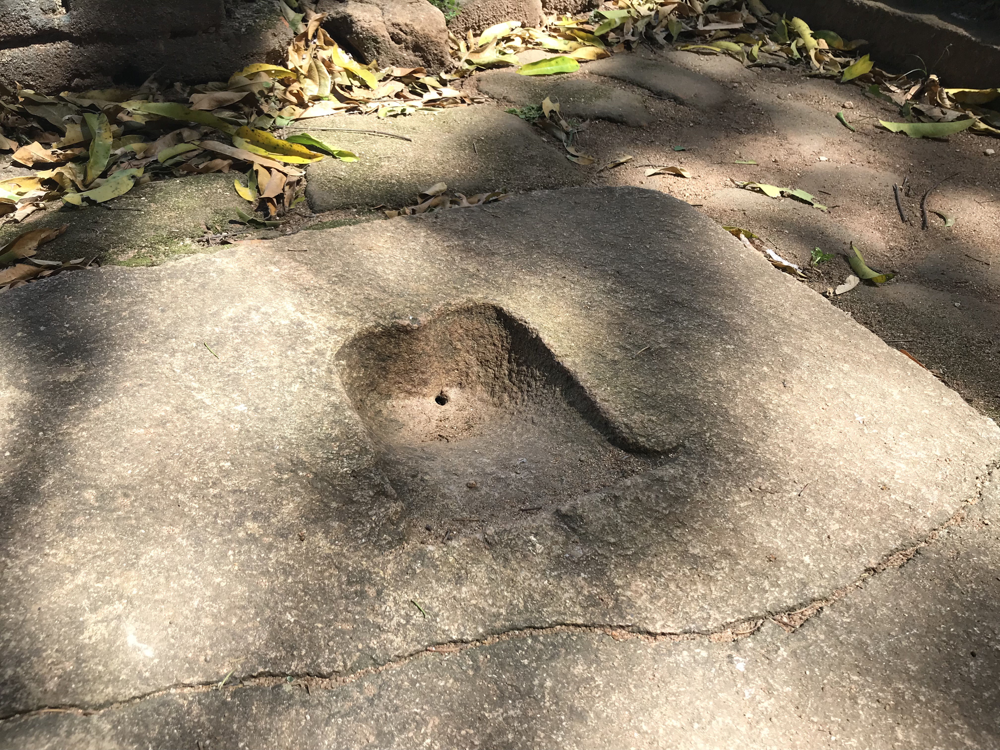

# 厕所行仪-出家众

> 参考《沙马内勒学处》 玛欣德尊者 著 第七章 第10节

上厕所者，应在外边站着咳嗽，里面坐着者也应咳嗽。

应把衣挂在衣竿或衣绳后，善缓而进入厕所。

不应太快进入，不应拉高[下衣]进入，应站在厕坑的踏板上拉高。

不得呻吟着大便，不得嚼着齿木大便。

不得在大便槽之外大便，不得在小便槽之外小便，不得吐唾液进小便槽。

### **大便池**

### **小便池**

{{#include ../part/line.md:1}}
拍摄于斯里兰卡黑水潭古寺遗址 Kaludiya Pokuna Sirilanka

不得用粗木橛刮擦；不得将刮屎橛丢进粪坑。

应站在厕坑的踏板上覆盖[下衣]。不应太快离开，不应拉高[下衣]离开，应站在洗净台的踏板上拉高。不得作喳噗喳噗声而洗净，不得将水残留在洗净盆。应站在洗净台的踏板上覆盖[下衣]。 

假如厕所污秽，应清洗。如果刮屎橛满了，应把 刮屎橛倒掉；如果厕所肮脏，应清扫厕所。如果灰泥 地板肮脏，应清扫地板；如果房间肮脏，应清扫房间；如果门廊肮脏，应清扫门廊；如果洗水罐之水没有了，把水灌进洗水罐。 

诸比库，此乃比库们于厕所应遵行的比库之厕所行仪。

{{#include ../part/line.md:1}}(V.4.374)